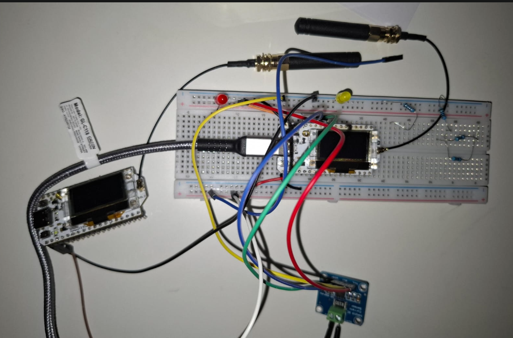
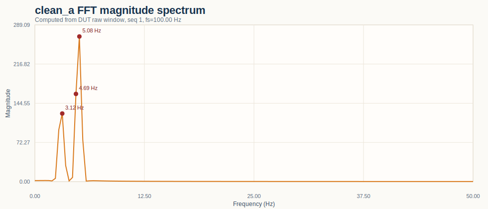
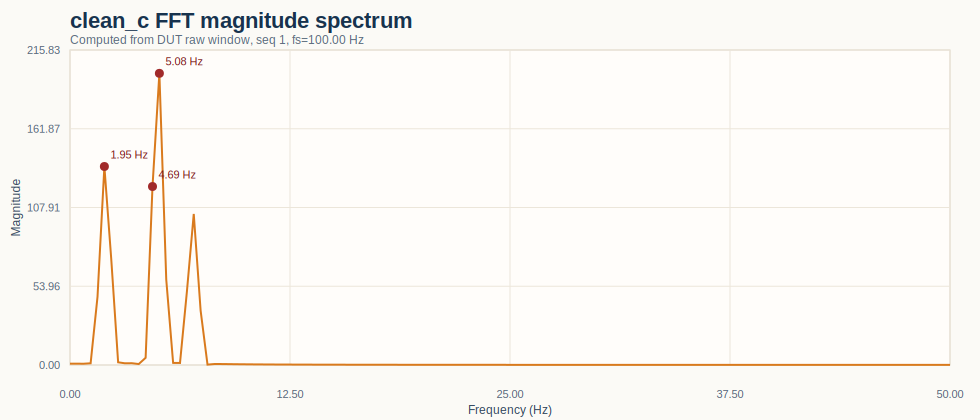

# IoT Individual Assignment

This project presents an adaptive sampling pipeline on a `Heltec WiFi LoRa 32 V3 (ESP32-S3)`. The node generates a known virtual signal, finds its dominant frequency with an FFT, lowers the sampling rate to a Nyquist-safe value, computes a `5 s` mean, and sends that aggregate to a nearby edge server over `MQTT/WiFi`.

The baseline signal used in the main validated run is:

```text
s(t) = 2*sin(2*pi*3*t) + 4*sin(2*pi*5*t)
```

The main idea is simple: if the strongest component is `5 Hz`, then sampling near `10 Hz` is enough for this signal, so the node does not need to stay at a much higher fixed rate all the time.

## Overview

The strongest evidence in this repository is the validated clean run under [source/results/20260422_clean_dut_no_ina219_60s_v2/SUMMARY.md](source/results/20260422_clean_dut_no_ina219_60s_v2/SUMMARY.md) and the evaluation notebook pack starting from [docs/evaluation/00_master_scoreboard.md](docs/evaluation/00_master_scoreboard.md).

Here is the short presentation view of the rubric:

| Topic | Status | Key result |
| --- | --- | --- |
| Max Sampling Frequency | Validated | Practical ceiling of the implemented FreeRTOS design is about `1000 Hz`, with a separate raw `analogRead()` reference near `16.6 kHz` |
| Optimal Frequency / FFT | Validated | FFT repeatedly detects `5.00 Hz`, then adaptation converges to `10.0 Hz` |
| Aggregation | Validated | `5 s` window at `10 Hz` gives `n = 50` samples in the validated run |
| Measure Energy | Partial | External `INA219` run shows `150.67 mA` average, but a matched adaptive-vs-fixed-rate A/B run is not yet measured |
| Measure Network | Validated | One aggregate is `6-7 B` instead of a `20000 B` raw 5-second float stream |
| Measure Latency | Validated | MQTT publish-to-edge mean `98.4 ms`, MQTT RTT mean `630.6 ms`, LoRa mean `11829.2 ms` |
| WiFi / MQTT | Validated | `5/5` aggregate messages sent and `5/5` received in the canonical session |
| LoRaWAN / TTN | Observed | `5` uplinks are recorded in the curated run, with end-to-end latency in the `1589-24863 ms` range |

## System Setup

The system uses one ESP32 as the main device under test and one optional monitor ESP32 for external power measurements. The DUT generates the virtual signal in firmware, samples it with FreeRTOS tasks, runs the FFT, computes the `5 s` mean, and publishes the result through MQTT. A second ESP32 plus `INA219` is used only when measuring current and power at the DUT input.

Main path:

```text
virtual signal -> sampling task -> FFT -> adaptive fs -> 5 s mean -> MQTT edge server
```

Secondary path:

```text
same 5 s mean -> LoRaWAN / TTN
```

High-level view:

```text
+-------------------+      +----------------+      +-------------------+
| virtual signal    | ---> | FFT + adapt fs | ---> | 5 s aggregation   |
+-------------------+      +----------------+      +-------------------+
                                                          |         |
                                                          v         v
                                                    MQTT edge   LoRaWAN / TTN
```

## Design Choices And Trade-Offs

These are the main engineering choices that shape the project:

- `10-100 Hz` adaptive clamp: keeps the system responsive and prevents unstable very-low or very-high rates
- `5 s` aggregation window: a middle ground between stable averages and reasonable update speed
- MQTT as the main demo path: local, fast, and repeatable
- LoRaWAN as secondary evidence: real cloud path, but slower and more environment-dependent
- external `INA219` measurement: more credible for power than only using firmware-side estimates

Main trade-offs:

- shorter aggregation window = faster updates, but noisier results and more traffic
- longer aggregation window = smoother results, but slower reporting
- dominant-peak tracking = simple and effective, but it can miss a weaker higher-frequency tone
- MQTT = stronger for live demo; LoRaWAN = stronger for cloud story

## Evaluation Results

### 1. Max Sampling Frequency

I measured the highest practical sampling rate of the implemented task-based firmware, not only the raw theoretical ADC limit of the ESP32-S3. Because the benchmark uses the same `1 ms` scheduling floor as the real sampler, the result is meaningful for the actual project and not just for a synthetic tight loop.

There are two useful ceilings to keep separate:

```text
raw analogRead() reference ~ 16662 Hz
task-based sampler ceiling ~ 1 / 1 ms = 1000 Hz
```

The first number is the rough bare-ADC throughput reference kept in the benchmark notes. The second number is the one I actually defend for this project, because the running FreeRTOS sampler cannot go faster than its `1 ms` floor.

Key result:

```text
fs ~ 1 / 1 ms = 1000 Hz
```

This is the value used in [docs/evaluation/01_max_sampling_frequency.md](docs/evaluation/01_max_sampling_frequency.md). The important point is that `1000 Hz` is the practical ceiling of this FreeRTOS design, while the `~16.6 kHz` figure is only a raw reference for a much tighter loop.


### 2. Optimal Frequency / FFT

I ran FFT analysis on the clean baseline signal and used the dominant component to update the next sampling frequency. For this signal, the expected maximum component is `5 Hz`, so the simplest Nyquist-safe target is around `10 Hz`.

Expected reasoning:

```text
fmax = 5 Hz
fs,opt ~ 2 * fmax = 10 Hz
```

The validated run shows the FFT repeatedly detecting `5.00 Hz` and the adaptive controller repeatedly updating the sampling rate to `10.0 Hz`.

Real log excerpt:

```text
[FFT]  dominant = 5.00 Hz  ->  fs updated to 10.0 Hz
[FFT]  dominant = 5.00 Hz  ->  fs updated to 10.0 Hz
[FFT]  dominant = 5.00 Hz  ->  fs updated to 10.0 Hz
```


### 3. Aggregation

I computed the mean over a fixed `5 s` window using only the most recent samples in the ring buffer. This matters because the corrected version now behaves like a true fixed-window aggregation, not like a mean over the whole retained history.

Expected sample count after adaptation:

```text
n = fs * 5 s = 10 * 5 = 50 samples
```

The canonical run shows five consecutive adapted windows with `n=50` at `10.0 Hz`.

Real log excerpt:

```text
[AGG]  win=92  mean=+0.0006  n=50  fs=10.0 Hz  proc_us=6636659
[AGG]  win=93  mean=-0.0000  n=50  fs=10.0 Hz  proc_us=6637239
...
[AGG]  win=96  mean=+0.0003  n=50  fs=10.0 Hz  proc_us=6638311
```

Once the node has converged to `10 Hz`, a `5 s` window should contain about `50` samples. That is exactly what appears in [source/results/20260422_clean_dut_no_ina219_60s_v2/results_agg.csv](source/results/20260422_clean_dut_no_ina219_60s_v2/results_agg.csv).

### 4. Measure Energy

The measured run is summarized in [tools/power_logs/20260422_141511_summary.md](tools/power_logs/20260422_141511_summary.md).

The hardware used for this measurement is shown below: one ESP32 runs the project and a second ESP32 with `INA219` monitors the DUT input externally.



Measured values from the `60 s` external monitor run:

| Metric | Value |
| --- | --- |
| Mean bus voltage | `4.945 V` |
| Overall average current | `150.67 mA` |
| Overall average power | `734.90 mW` |

Measured state breakdown:

| State | Share | Avg current | Avg power |
| --- | --- | --- | --- |
| `WIFI_IDLE` | `94.67%` | `146.40 mA` | `717.30 mW` |
| `ACTIVE` | `1.33%` | `173.25 mA` | `753.50 mW` |
| `TX` | `4.00%` | `244.23 mA` | `1145.17 mW` |


The measured state averages above are the clean summary view. The Better Serial Plotter capture below is the more visual live view of the same measurement path: you can see the current and power changing over time, with a mostly steady idle region and short higher-consumption bursts during active work and transmission.


The measured run shows that total power is dominated much more by `WIFI_IDLE` and radio transmission than by the sampler alone. This is why the proxy model shows only a small gain in the always-awake WiFi configuration: lowering the sampling rate helps, but it does not remove WiFi overhead.

Important limit of the current evidence:

```text
not yet measured: matched INA219 A/B run for adaptive mode vs forced 100 Hz oversampling
```

So the README can defend the real measured power states, but it should not claim a measured external percent delta between adaptive sampling and a fixed oversampling mode yet. That direct percentage comparison is still only available from the firmware proxy model.

### 5. Measure Network

I compared the real aggregate payload with a simple raw-stream baseline for one `5 s` window. This keeps the comparison easy to explain during the presentation.

Raw-stream baseline:

```text
1000 Hz * 5 s * 4 B = 20000 B
```

Real MQTT payload in the validated run:

```text
6-7 B
```

| Case | Bytes for one 5 s window |
| --- | ---: |
| Raw float stream at `1000 Hz` | `20000 B` |
| Aggregated MQTT payload | `6-7 B` |
| Reduction factor | about `2857x` to `3333x` |

Real log excerpt:

```text
[MQTT] #92 avg=0.0006  payload=6 B  total=597 B  baseline=1840000 B  ratio=3082x
```

The node sends one useful summary instead of thousands of raw samples. This is the main reason why local aggregation is valuable in the project.

### 6. Measure Latency

Both communication paths reuse the same aggregated value from the same `5 s` window. That makes the comparison fair, because MQTT and LoRa are sending the same kind of information instead of different payloads.

I also keep latency and aggregation separate on purpose. The `5 s` window tells me how often a result is created. Latency tells me how long one created result needs to travel after it is ready.

So I kept three latency views separate, because they do not mean the same thing:

- MQTT publish-to-edge receive delay
- MQTT ping-pong RTT
- LoRa end-to-end latency

| Path | Mean | Notes |
| --- | ---: | --- |
| MQTT publish to edge receive | `98.4 ms` | fastest and most representative edge metric |
| MQTT RTT | `630.6 ms` | includes broker, Python edge server, and return path |
| LoRa end-to-end | `11829.2 ms` | much slower and more variable than MQTT |

Detailed values are already collected in [docs/evaluation/06_end_to_end_latency.md](docs/evaluation/06_end_to_end_latency.md) and in the canonical result bundle.

The MQTT path is local and lightweight, while the LoRaWAN path naturally adds airtime, gateway, and network delays. For MQTT, the publish-to-edge delay is the clearest practical number. For LoRaWAN, the delay is much larger because the radio path and network handling take longer. They should not be treated as one single latency number.

### 7. WiFi / MQTT

I used the `5 s` aggregate as the message payload and sent it from the ESP32 over WiFi to a local MQTT broker. The Python edge listener subscribed to the topic, logged the values, and echoed the ping message used for RTT measurement. This is the cleanest end-to-end path in the repository, so it is the one I would present live first.

The canonical run shows `5/5` WiFi/MQTT messages sent and `5/5` received at the edge listener.

Real send/receive evidence:

```text
send: 2026-04-22T12:05:16.901+02:00,92,0.0006,6,...
recv: 2026-04-22T12:05:16.997+02:00,eri/iot/average,0.0006
...
send: 2026-04-22T12:06:03.442+02:00,96,0.0003,6,...
recv: 2026-04-22T12:06:03.465+02:00,eri/iot/average,0.0003
```


### 8. LoRaWAN / TTN

I keep LoRaWAN as a secondary path in the presentation: it is implemented and observed, but it is much more dependent on gateway coverage and join conditions than the local MQTT path.

The same `5 s` aggregate used for MQTT is also reused for LoRaWAN. This keeps the communication comparison simple: only the transport path changes, not the local processing step.

What the curated run shows:

- `5` uplinks reached the cloud path
- end-to-end latency ranged from `1589 ms` to `24863 ms`
- the mean LoRa latency in that run was `11829.2 ms`

That makes the LoRa result real, but clearly slower and more variable than MQTT.

These screenshots are the clearest TTN-side proof already stored in the repo:


Short explanation:

- the first screenshot shows uplink activity reaching TTN
- the second screenshot shows the TTN device-side view and configuration context
- together they support the claim that the LoRaWAN path was observed, even though it is less repeatable than the local MQTT path

## Bonus


```text
does the controller follow the highest tone in the signal, or only the dominant FFT peak?
```

The main bonus result is a measured three-signal matrix that makes that answer visible.

### 1. Three Clean Signal Variants

Measured clean signals:

| Signal | Formula | Expected highest | Measured dominant | Adaptive fs |
| --- | --- | ---: | ---: | ---: |
| A | `2*sin(2*pi*3*t)+4*sin(2*pi*5*t)` | `5 Hz` | `5.00 Hz` | `10.00 Hz` |
| B | `4*sin(2*pi*3*t)+2*sin(2*pi*9*t)` | `9 Hz` | `3.01 Hz` | `10.00 Hz` |
| C | `2*sin(2*pi*2*t)+3*sin(2*pi*5*t)+1.5*sin(2*pi*7*t)` | `7 Hz` | `5.03 Hz` | `10.10 Hz` |

The interesting finding is that the current controller adapts from the FFT dominant peak, not from the highest tone present in the signal. That is why signal B does not jump toward `18 Hz`: the `3 Hz` tone is stronger than the `9 Hz` tone, and the lower clamp keeps the final rate at `10 Hz`.

The visual explanation for each signal is below. The plots come from the implemented formulas, while the dominant/adaptive values come from the measured DUT sessions listed in [tools/bonus_results/clean_signal_matrix_20260424.md](tools/bonus_results/clean_signal_matrix_20260424.md).

#### Signal A: baseline and expected behavior

Signal A is the clean reference case. The `5 Hz` tone is both the strongest one and the highest important one, so the controller behaves exactly as intended.



Why this plot matters:

- the main peaks are around `5 Hz` and `3 Hz`
- the `5 Hz` peak is the dominant one
- the measured controller response is therefore `5.00 Hz -> 10.00 Hz`

#### Signal B: weak high-frequency tone

Signal B is more interesting because it contains a higher `9 Hz` component, but that component is weaker than the `3 Hz` component.


Why this plot matters:

- the spectrum still shows the `9 Hz` tone
- the stronger `3 Hz` tone dominates the FFT decision
- the measured controller response becomes `3.01 Hz -> 10.00 Hz`, not `9 Hz -> 18 Hz`

This is the clearest evidence that the current rule follows the dominant peak, not the highest tone present.

#### Signal C: more complex three-tone case

Signal C adds a third tone to make the spectrum slightly richer without making the explanation too hard.



Why this plot matters:

- three components are present: about `2 Hz`, `5 Hz`, and `7 Hz`
- the `5 Hz` tone is still the strongest one
- the measured controller response stays near `5.03 Hz -> 10.10 Hz`

So even in the more complex case, the controller still behaves like a dominant-tone tracker.

### 2. Anomaly Filtering

The firmware also includes Z-score and Hampel-based anomaly filtering for spike-like disturbances. This is a good bonus topic because it adds an extra local-processing layer on top of the main sampling and aggregation pipeline. The related notes are collected in [docs/evaluation/13_bonus_anomaly_filtering.md](docs/evaluation/13_bonus_anomaly_filtering.md).

Good short message for the bonus slide:

```text
main path: clean signal -> FFT -> adaptive fs -> aggregation -> MQTT
bonus finding: the current rule follows the dominant peak, not always the highest tone
```

Measured bonus details are collected in [docs/evaluation/12_bonus_signal_matrix.md](docs/evaluation/12_bonus_signal_matrix.md), [tools/bonus_results/clean_signal_matrix_20260424.md](tools/bonus_results/clean_signal_matrix_20260424.md), and [source/results/20260424_clean_signal_matrix_plots/SUMMARY.md](source/results/20260424_clean_signal_matrix_plots/SUMMARY.md).


## How To Reproduce

1. Create local credentials:

```bash
cp firmware/src/config.h.example firmware/src/config.h
```

2. Fill in WiFi, MQTT broker, and optional TTN credentials.

3. Flash the DUT firmware:

```bash
cd firmware
~/.platformio/penv/bin/pio run -e heltec_wifi_lora_32_V3 -t upload --upload-port /dev/ttyUSB0
```

4. Start the edge listener:

```bash
cd tools
python edge_server.py
```

5. Open the serial monitor:

```bash
stty -F /dev/ttyUSB0 115200 raw cs8 -cstopb -parenb && cat /dev/ttyUSB0
```

6. For power measurements, use the separate monitor path described in [tools/power_logs/20260422_141511_summary.md](tools/power_logs/20260422_141511_summary.md) and `tools/monitor_esp32/`.

## Final Takeaways

- The project correctly detects the dominant `5 Hz` component of the clean signal and adapts the sampling rate to `10 Hz`.
- The aggregate is computed over a real `5 s` time window, and the validated run shows the expected `50` samples per window after adaptation.
- MQTT over WiFi is the strongest end-to-end path in the repo: it is local, validated, and easy to demonstrate.
- Network cost drops dramatically because the node sends one aggregate instead of thousands of raw samples.
- Energy evidence is usable but partial: the INA219 run shows real power states, but a matched adaptive-vs-fixed-rate external A/B comparison is still missing.
- LoRaWAN is implemented and observed, but it is slower and more environment-dependent, with the curated run ranging from `1589 ms` to `24863 ms` end to end.
