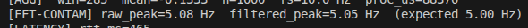

# IoT Individual Assignment

Adaptive sampling pipeline on `ESP32-S3 / Heltec WiFi LoRa 32 V3` using `FreeRTOS`, `FFT`, `MQTT`, optional `LoRaWAN`, and an external `INA219` monitor path for power measurements.

## Table Of Contents

- [Overview](#overview)
- [Why This Project Exists](#why-this-project-exists)
- [Evaluation Map](#evaluation-map)
- [Assignment Coverage](#assignment-coverage)
- [System Architecture](#system-architecture)
- [Hardware Setup](#hardware-setup)
- [Repository Layout](#repository-layout)
- [Implementation Walkthrough](#implementation-walkthrough)
- [Setup And Run](#setup-and-run)
- [Logs And Results Layout](#logs-and-results-layout)
- [Expected Runtime Output](#expected-runtime-output)
- [Validated Results](#validated-results)
- [Power Measurement](#power-measurement)
- [Plots And Evidence](#plots-and-evidence)
- [Evidence Gallery](#evidence-gallery)
- [Presentation Notes](#presentation-notes)
- [Current Limitations](#current-limitations)
- [References](#references)

## Overview

This project implements an end-to-end IoT node that generates a virtual signal on an `ESP32-S3`, finds its dominant frequency with an FFT, adapts the sampling rate, computes a `5 s` aggregate window, and sends that aggregate to a nearby edge server over `MQTT/WiFi`.

The same aggregate can also be sent through `LoRaWAN` when join conditions and coverage allow it.

The input signal used in the main validation path is:

```text
s(t) = 2*sin(2*pi*3*t) + 4*sin(2*pi*5*t)
```

Core idea:

- sample the signal locally
- estimate the dominant frequency
- reduce the sampling rate to a Nyquist-safe value
- aggregate locally over a fixed time window
- send one useful summary instead of many raw samples

## Why This Project Exists

The main goal is to show that the node can do useful local processing before communication.

Instead of sampling at a high fixed rate forever and sending all values, the node:

1. discovers the dominant frequency content of the signal
2. lowers the sampling rate to what is actually needed
3. computes one aggregate every `5 s`
4. transmits only that aggregate

Why this matters:

- it reduces unnecessary sampling work
- it reduces communication volume
- it is easier to justify from both a signal-processing and IoT perspective

At a high level, the project is about adapting locally instead of only transmitting raw data.

## Evaluation Map

This section maps the project directly to the evaluation items shown in the grading rubric.

### Max Freq

The project measures a practical maximum sampling frequency of about `1000 Hz` for this implemented design.

Why this matters:

- it shows the highest rate the current task-based solution can sustain
- it gives a reference point before adaptive reduction

Where it is reflected:

- [Results Summary](#validated-results)
- [Maximum sampling rate screenshot](images/02_max_sampling_rate.png)

### Optimal Freq

The optimal sampling frequency for the chosen signal is about `10 Hz`.

Why:

- the dominant signal component is about `5 Hz`
- sampling at about twice that value is enough for this signal

Where it is reflected:

- [FFT And Adaptive Sampling](#implementation-walkthrough)
- [Validated Results](#validated-results)
- [FFT adaptive sampling screenshot](images/03_fft_adaptive_sampling.png)

### Aggregation

The project computes the mean over a fixed `5 s` window.

Why this matters:

- it satisfies the aggregation requirement
- it reduces the amount of transmitted data
- it makes the edge output easier to interpret

Where it is reflected:

- [Fixed Aggregation Window](#implementation-walkthrough)
- [Validated Results](#validated-results)
- `[AGG]` log lines in the DUT results bundle

### Measure Energy

Energy is discussed using the external `INA219` monitor path and supported by real measured current and power values.

What was measured:

- overall average current
- overall average power
- current and power by detected state
- a simple daily-use estimate based on the measured average

Where it is reflected:

- [Power Measurement](#power-measurement)
- [Better Serial Plotter power screenshot](images/09_serial_plotter_dashboard.png)
- files under [`tools/power_logs/`](tools/power_logs)

### Measure Network

The network part is evaluated by showing that the aggregate is sent over WiFi and received by the edge listener, and by comparing the transmitted aggregate with a much larger raw-data baseline.

What is shown:

- WiFi + MQTT communication works end to end
- one aggregate is much smaller than sending all raw samples
- the laptop receives the published values correctly

Where it is reflected:

- [MQTT Edge Communication](#implementation-walkthrough)
- [Validated Results](#validated-results)
- [Edge server screenshot](images/04_edge_server_receiving.png)
- [MQTT topics screenshot](images/06_mosquitto_sub_topics.png)

### Measure Latency

Latency is evaluated from the communication path.

What was measured:

- MQTT round-trip time
- LoRa end-to-end latency in the validated run

Where it is reflected:

- [Validated Results](#validated-results)
- `source/results/.../results_latency.csv`
- `source/results/.../results_lora.csv`
- [MQTT latency screenshot](images/05_mqtt_latency_serial.png)

### MQTT

MQTT is the main validated communication protocol in this project.

Why it is important:

- it is the clearest end-to-end demo path
- it shows the aggregate leaving the ESP32 and reaching the laptop
- it is the most stable communication path in the final validation

Where it is reflected:

- [MQTT Edge Communication](#implementation-walkthrough)
- [How To Demo It](#how-to-demo-it)
- [Validated Results](#validated-results)

### LoRaWAN

LoRaWAN is implemented as an additional communication path.

How it should be presented:

- it exists and was observed in the validated results bundle
- it is slower and more dependent on the environment than MQTT
- it should be treated as secondary evidence, not the main live demo path

Where it is reflected:

- [LoRaWAN Uplink](#implementation-walkthrough)
- [Validated Results](#validated-results)
- [LoRa and TTN screenshots](#evidence-gallery)

## Assignment Coverage

| Requirement | Status | Notes |
| --- | --- | --- |
| Maximum sampling frequency | Done | Practical schedulable rate measured around `1000 Hz` in the implemented FreeRTOS design |
| Maximum input frequency | Done | FFT identifies the dominant component around `5 Hz` |
| Optimal sampling frequency | Done | Adaptive rate stabilizes around `10 Hz` |
| Aggregate over a window | Done | Mean computed over `5 s` windows |
| MQTT + WiFi edge delivery | Done | Python edge listener receives aggregate payloads |
| LoRaWAN + TTN cloud delivery | Implemented and observed | Works, but remains more environment-dependent than MQTT |
| Communication cost evaluation | Done | Repo logs aggregate-only transmission and compression ratios |
| End-to-end latency evaluation | Done | MQTT RTT and LoRa e2e latency were logged |
| Energy evaluation | Partial but usable | Firmware proxy exists and an external INA219 monitor path was measured |
| Bonus anomaly handling | Done | Noise mode, spike mode, Z-score, and Hampel logic are included |

## System Architecture

```text
virtual signal
    -> sampler task
    -> FFT analysis
    -> adaptive sampling controller
    -> 5 s aggregation window
    -> MQTT edge server
    -> optional LoRaWAN / TTN uplink
```

Main runtime tasks:

- `sampler_task`: samples the synthetic signal and fills the working buffers
- `fft_task`: computes the FFT and updates the adaptive sampling rate
- `aggregator_task`: computes the `5 s` mean and triggers transmissions
- `mqtt_loop_task`: keeps the MQTT connection alive

Main communication path:

```text
ESP32 -> WiFi -> MQTT broker -> edge_server.py on laptop
```

This separation helps show that the system was designed as a pipeline, not as one long loop.

## Hardware Setup

The project was developed around:

- one `Heltec WiFi LoRa 32 V3` DUT
- one optional second ESP32 for `INA219`-based external power monitoring

Hardware reference image:


## Repository Layout

```text
firmware/
  src/                 main ESP32 firmware
  platformio.ini       build environments and dependencies

tools/
  edge_server.py       MQTT edge listener
  serial_plotter.py    host-side plotting utility
  power_bridge.py      helper for measurement workflows
  monitor_esp32/       INA219 monitor firmware for plotting-oriented runs
  plot_sessions/       raw timestamped DUT capture sessions
  power_logs/          external INA219 measurement logs and plots

images/
  screenshot evidence used in the demo / submission

source/
  results/             curated validated result bundle
```

Most relevant files:

- `firmware/src/main.cpp`
- `firmware/src/tasks.cpp`
- `firmware/src/aggregator.cpp`
- `firmware/src/fft_analysis.cpp`
- `firmware/src/mqtt_client.cpp`
- `firmware/src/lorawan.cpp`
- `firmware/src/display.cpp`
- `tools/edge_server.py`
- `tools/plot_capture.py`
- `tools/generate_session_plots.py`
- `tools/monitor_esp32/src/main.cpp`

## Implementation Walkthrough

### 1. Signal Generation

The signal is generated directly on the ESP32 in firmware, not by an external physical sensor.

Why this choice was useful:

- the frequency content is known in advance
- it is easier to verify whether the FFT is correct
- it makes the adaptive sampling behavior easier to defend

For this signal:

- one component is at `3 Hz`
- one stronger component is at `5 Hz`
- the dominant frequency is therefore about `5 Hz`
- by Nyquist, a sensible adaptive target is about `10 Hz`

That is why the sampling controller converges around `10 Hz`.

### 2. Maximum Practical Sampling Frequency

The project uses a practical maximum of about `1000 Hz`.

This is not presented as a theoretical ESP32 limit. It is the practical ceiling of this implemented design, mainly because the scheduler works at a `1 ms` scale here.

Simple wording for discussion:

`the practical maximum sampling rate of this implemented FreeRTOS design is about 1000 Hz, but the meaningful operating rate for this signal becomes about 10 Hz after FFT adaptation`

### 3. FFT And Adaptive Sampling

The firmware gathers a sample window, runs an FFT, estimates the dominant frequency, and updates the current sampling rate.

What this is supposed to show:

- the signal-processing stage works
- the system can adjust itself automatically
- the final rate is justified by the observed signal rather than chosen arbitrarily

In the validated runs, the dominant frequency repeatedly converged to about `5 Hz`, and the adaptive sampling rate converged to about `10 Hz`.

### 4. Fixed Aggregation Window

Every `5 s`, the firmware computes the mean of the most recent window and uses that as the transmitted value.

Why this matters:

- it matches the assignment requirement for local aggregation
- it reduces communication volume
- it makes the edge/cloud path much simpler to explain

After the aggregation fix, the validated runs showed window sizes around `n=50` at `10 Hz`, which is exactly what should happen for a `5 s` window.

### 5. MQTT Edge Communication

The aggregate is sent to a local MQTT broker over WiFi. A Python edge listener receives it and logs it.

This is the strongest live demo path in the repo because it is the most repeatable and was clearly validated end to end.

### 6. LoRaWAN Uplink

The same aggregate can also be sent through LoRaWAN.

This path is implemented and was observed successfully in the validated results bundle, but it is slower and more dependent on the environment than MQTT. It is best presented as a secondary path, not the main live demo path.

### 7. Display And Monitoring

The DUT firmware includes an OLED dashboard with rotating pages for:

- sampling frequency
- FFT result
- aggregate state
- MQTT status
- RTT
- LoRa join state

The repo also contains a separate monitor path under `tools/monitor_esp32/` for external INA219-based power measurements.

## Setup And Run

### 1. Prepare Local Credentials

Create the local config from the example:

```bash
cp firmware/src/config.h.example firmware/src/config.h
```

Then fill in:

- WiFi SSID and password
- MQTT broker host / port / topic settings
- TTN credentials if you want to test LoRaWAN

### 2. Build And Upload DUT Firmware

```bash
cd firmware
~/.platformio/penv/bin/pio run -e heltec_wifi_lora_32_V3 -t upload --upload-port /dev/ttyUSB0
```

Other signal-mode environments are available in `firmware/platformio.ini`.

### 3. Open The DUT Serial Monitor

```bash
stty -F /dev/ttyUSB0 115200 raw cs8 -cstopb -parenb && cat /dev/ttyUSB0
```

### 4. Start The Edge Server

```bash
cd tools
python edge_server.py
```

The listener also accepts:

- `MQTT_BROKER_HOST`
- `MQTT_BROKER_PORT`

### 5. Optional Plot-Capture Workflow

To capture DUT-based report figures, use one of the dedicated plot builds:

```bash
cd firmware
~/.platformio/penv/bin/pio run -e clean_plot_capture -t upload --upload-port /dev/ttyUSB0
```

Then:

```bash
python3 -m venv /tmp/plot-venv
/tmp/plot-venv/bin/pip install -r tools/requirements.txt
/tmp/plot-venv/bin/python tools/plot_capture.py --port /dev/ttyUSB0 --max-windows 8 --session-name clean_dut
/tmp/plot-venv/bin/python tools/generate_session_plots.py tools/plot_sessions/<session_folder>
```

This produces:

- waveform and FFT plots
- adaptive sampling plot
- MQTT path plot
- latency plots
- parsed CSV files and markdown provenance records

### 6. Optional External Power Monitor Path

```bash
cd tools/monitor_esp32
~/.platformio/penv/bin/pio run -e monitor -t upload --upload-port /dev/ttyUSB0
stty -F /dev/ttyUSB0 115200 raw cs8 -cstopb -parenb && cat /dev/ttyUSB0
```

This path is used for the `INA219` power measurements described later in this README.

## Logs And Results Layout

The repo has three useful layers of results and logs:

- [`tools/plot_sessions/`](tools/plot_sessions): raw DUT capture sessions with parsed logs and generated plots
- [`tools/power_logs/`](tools/power_logs): external INA219 measurement logs and derived plots
- [`source/results/`](source/results): curated validated result bundle for submission/report use

How to read them:

- `tools/edge_log.csv`: long-running MQTT listener history
- `tools/plot_sessions/<timestamp>_<name>/serial.log`: raw DUT serial stream
- `tools/plot_sessions/<timestamp>_<name>/*.csv`: parsed DUT session outputs
- `tools/power_logs/*.tsv` and `*.csv`: external current/power captures and summaries
- `source/results/README.md`: top-level entry point for the canonical validated DUT result bundle

Structured DUT prefixes in `serial.log`:

- `[FFT]`: dominant frequency estimate and adaptive rate update
- `[AGG]`: `5 s` aggregate window
- `[MQTT]`: publish summary and compression ratio
- `[LATENCY]`: MQTT RTT
- `[LoRa]`: uplink summary and end-to-end latency
- `[PLOT]` and `[PLOT-SAMPLES]`: raw FFT-window capture for figure generation
- `[ENERGY]` and `[ANOMALY]`: supplemental instrumentation

If you only need the strongest validated DUT evidence, start here:

- [`source/results/README.md`](source/results/README.md)
- [`source/results/20260422_clean_dut_no_ina219_60s_v2/SUMMARY.md`](source/results/20260422_clean_dut_no_ina219_60s_v2/SUMMARY.md)
- [`source/results/20260422_clean_dut_no_ina219_60s_v2/PLOT_DATA_RECORDS.md`](source/results/20260422_clean_dut_no_ina219_60s_v2/PLOT_DATA_RECORDS.md)

## Expected Runtime Output

Typical lines from the main firmware look like:

```text
[FFT] dominant = 5.00 Hz -> fs updated to 10.0 Hz
[AGG] win=3 mean=+0.0001 n=50 fs=10.0 Hz proc_us=...
[MQTT] #3 avg=0.0012 payload=6 B total=18 B ...
[LATENCY] rtt_ms=312
```

Typical OLED behavior on the DUT:

- splash screen at boot
- rotating dashboard pages
- frequency and mode information
- aggregate / window information
- MQTT / RTT / LoRa status

## Validated Results

The canonical validated clean DUT run is:

- [`source/results/20260422_clean_dut_no_ina219_60s_v2/`](source/results/20260422_clean_dut_no_ina219_60s_v2/)

It was exported from:

- `tools/plot_sessions/20260422_120509_clean_dut_no_ina219_60s_v2/`

Validated metrics from that session:

| Metric | Value |
| --- | --- |
| Maximum practical sampling frequency | about `1000 Hz` |
| Dominant signal frequency | `5.00 Hz` |
| Adaptive sampling frequency | `10.00 Hz` |
| FFT updates captured | `3` |
| Aggregation windows captured | `5` windows of `5 s` each |
| Samples per adapted window | about `50` |
| MQTT delivery | `5/5` sent and received at the edge listener |
| MQTT RTT | mean `630.6 ms`, max `891.0 ms` |
| LoRa uplinks | `5` captured |
| LoRa end-to-end latency | mean `11829.2 ms`, range `1589-24863 ms` |

What these results mean:

- the FFT stage is finding the expected dominant frequency
- the adaptive rate is converging to a safe value near `10 Hz`
- the corrected aggregation window behaves as intended
- MQTT is the strongest and most repeatable communication path
- LoRaWAN works, but remains slower and more environment-sensitive

## Power Measurement

The repo also contains one measured external `INA219` monitor capture from the separate monitor ESP32 path:

- [`tools/power_logs/20260422_141511_summary.md`](tools/power_logs/20260422_141511_summary.md)
- [`tools/power_logs/20260422_141511_phase_summary.csv`](tools/power_logs/20260422_141511_phase_summary.csv)
- [`tools/power_logs/20260422_141511_current_timeline.png`](tools/power_logs/20260422_141511_current_timeline.png)
- [`tools/power_logs/20260422_141511_phase_averages.png`](tools/power_logs/20260422_141511_phase_averages.png)

Measured values from that `60 s` monitor run:

| Power Metric | Value |
| --- | --- |
| Mean bus voltage | `4.945 V` |
| Overall average current | `150.67 mA` |
| Overall average power | `734.90 mW` |
| Estimated daily charge use | `3616.08 mAh/day` |
| Estimated daily energy use | `17.64 Wh/day` |

Detected states in that run:

| State | Share | Average Current | Average Power |
| --- | --- | --- | --- |
| `WIFI_IDLE` | `94.67%` | `146.40 mA` | `717.30 mW` |
| `ACTIVE` | `1.33%` | `173.25 mA` | `753.50 mW` |
| `TX` | `4.00%` | `244.23 mA` | `1145.17 mW` |

Why these numbers matter:

- they are external measurements at the DUT power input
- they are stronger evidence than only using a firmware-side proxy
- they give a clear picture of how power changes across different states

Important caution:

- this is a measured snapshot, not a full battery discharge study
- the monitored run did not capture a true deep idle/deep sleep state

## Plots And Evidence

The repo includes both DUT-derived plots and external power plots.

### DUT Plot Bundle

The curated DUT figure set is documented here:

- [`source/results/README.md`](source/results/README.md)

It includes:

- waveform snapshot
- FFT spectrum
- adaptive sampling history
- aggregate values across the MQTT path
- MQTT latency distribution
- LoRa latency

### External Power Plot Bundle

The external monitor plots are here:

- [`tools/power_logs/20260422_141511_current_timeline.png`](tools/power_logs/20260422_141511_current_timeline.png)
- [`tools/power_logs/20260422_141511_phase_averages.png`](tools/power_logs/20260422_141511_phase_averages.png)

These show:

- current and power over time
- average current and power by detected state

## Evidence Gallery

The following screenshots are already stored in [`images/`](images):

### Hardware


### Core MQTT Demo Path

Maximum schedulable sampling rate:


FFT-based frequency detection and adaptive sampling:


Edge server receiving aggregates:


Serial output showing MQTT publish and latency:


MQTT topics observed from `mosquitto_sub`:


### LoRa And Power Evidence

LoRaWAN / TTN evidence:


Better Serial Plotter power-monitor capture:


### Extra Analysis

Anomaly detection output:


FFT contamination / filtering check:



## Presentation Notes

The clearest oral discussion path is:

1. explain that the signal is known and generated in firmware
2. explain why `5 Hz` should be the dominant component
3. explain why Nyquist implies about `10 Hz`
4. show that the validated logs actually converge there
5. show the `5 s` mean and the MQTT delivery path
6. mention LoRa as implemented but environment-dependent
7. show the external power snapshot as measured supporting evidence

The clearest concise claims are:

- the project performs local signal processing before communication
- the dominant frequency is about `5 Hz`
- the adaptive sampling rate converges near `10 Hz`
- the aggregate is computed over a `5 s` window
- MQTT is the main validated delivery path
- LoRaWAN is implemented and was observed, but it is less stable than MQTT
- external INA219 monitoring provides a measured power snapshot across states

The safest careful wording is:

- the `1000 Hz` figure is the practical ceiling of this implemented task-based design, not a theoretical ESP32 maximum
- the energy numbers are useful evidence, but they are not a full battery-life experiment
- the strongest live demo path is FFT -> adaptive fs -> aggregate -> MQTT

## Current Limitations

- LoRaWAN proof depends on coverage, join timing, and the local environment
- the clean canonical DUT run used firmware with `INA219` disabled; measured power comes from the separate monitor ESP32 path
- the power snapshot did not capture a true deep idle/deep sleep state
- the repo is strongest when presented as an adaptive sampling + local aggregation + MQTT system, with LoRa and energy as secondary evidence

## References

- [arduinoFFT](https://github.com/kosme/arduinoFFT)
- [RadioLib](https://github.com/jgromes/RadioLib)
- [PubSubClient](https://github.com/knolleary/pubsubclient)
- [U8g2](https://github.com/olikraus/u8g2)
