# ESP32 Adaptive Sampling IoT System

Individual IoT assignment implementation using a `Heltec WiFi LoRa 32 V3`, Arduino on PlatformIO, FreeRTOS tasks, FFT-based adaptive sampling, MQTT/WiFi edge delivery, LoRaWAN/TTN uplinks, and anomaly-aware signal modes.

The project uses a virtual sensor so the input is repeatable and easy to validate:

```text
s(t) = 2*sin(2*pi*3*t) + 4*sin(2*pi*5*t)
```

The clean signal has a dominant `5 Hz` component. The firmware detects that frequency with an FFT and now uses a conservative production-style policy: `8x` oversampling, rounded to practical steps. For the main signal, that means `5 Hz * 8 = 40 Hz`, then a `5 s` aggregate is transmitted instead of raw samples.

## What To Look At First

- Signal: `3 Hz + 5 Hz`, with `5 Hz` dominant.
- Adaptive result: FFT reports about `5.02 Hz`, so sampling becomes `40.0 Hz`.
- Aggregation result: `40 Hz * 5 s = 200` samples per window.
- Max benchmark: raw virtual-sensor ceiling `56561 Hz`; FreeRTOS-paced ceiling `999 Hz`.

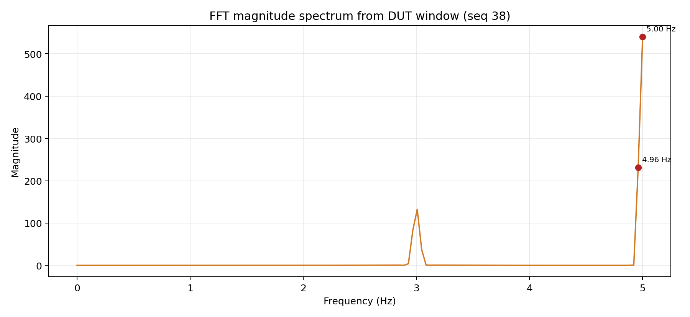

## Table Of Contents

- [What To Look At First](#what-to-look-at-first)
- [Current Status](#current-status)
- [Assignment Coverage](#assignment-coverage)
- [System Architecture](#system-architecture)
- [Design Rationale](#design-rationale)
- [Code Organization](#code-organization)
- [Important Functions](#important-functions)
- [Core Results](#core-results)
- [Evidence Gallery](#evidence-gallery)
- [Setup And Run](#setup-and-run)
- [Presentation Walkthrough](#presentation-walkthrough)
- [Known Limits](#known-limits)

## Current Status

The core pipeline is implemented and validated on the real board:

- virtual signal generation in firmware
- FreeRTOS sampler, FFT, and aggregation tasks
- dominant-frequency detection at `5.00 Hz`
- adaptive sampling policy updated to `8x` dominant frequency, so the main signal targets `40.0 Hz`
- `5 s` aggregation windows target `n = 200` samples after adaptation
- MQTT/WiFi edge delivery with sender and receiver logs
- richer MQTT aggregate metadata on `eri/iot/aggregate`, while keeping the legacy small average topic
- LoRaWAN/TTN uplink evidence and latency records
- external INA219 power monitoring with a second board
- bonus signal families and anomaly-detection code paths

The best single evidence bundle is:

- [source/results/20260422_clean_dut_no_ina219_60s_v2/SUMMARY.md](source/results/20260422_clean_dut_no_ina219_60s_v2/SUMMARY.md)

The best technical explanation pack is:

- [docs/evaluation/00_master_scoreboard.md](docs/evaluation/00_master_scoreboard.md)

Read the results in two layers. The first layer is the core correctness path: the signal is known, the FFT finds the expected `5 Hz` component, the sampler adapts using the configured policy, and the `5 s` aggregate contains `fs * 5` samples. The second layer is the system-performance path: the same aggregate is sent through MQTT and LoRaWAN, then evaluated for payload size, latency, and power behavior.

The fresh `2026-05-13` clean capture confirms the current conservative `8x` policy for the local processing path: the FFT repeatedly reports `5.02 Hz`, the adaptive rate stays at `40.0 Hz`, and each `5 s` aggregation window contains `200` samples. MQTT and LoRa delivery still rely on the older validated bundle until a broker-reachable fresh capture is made.

## Assignment Coverage

| Requirement | Current result | Evidence | Status |
| --- | --- | --- | --- |
| Maximum sampling frequency | Fresh ESP32 boot benchmark: raw virtual-sensor ceiling `56561 Hz`; FreeRTOS-paced application ceiling `999 Hz` | [firmware/src/benchmark.cpp](firmware/src/benchmark.cpp), [docs/evaluation/01_max_sampling_frequency.md](docs/evaluation/01_max_sampling_frequency.md) | Freshly captured |
| FFT and adaptive sampling | Current policy: FFT detects `5.02 Hz`; adaptive target becomes `40.0 Hz` (`8x`) | [firmware/src/tasks.cpp](firmware/src/tasks.cpp), [tools/plot_sessions/20260513_090512_clean_40hz_new-fixes_retry/SUMMARY.md](tools/plot_sessions/20260513_090512_clean_40hz_new-fixes_retry/SUMMARY.md) | Freshly captured |
| Window aggregation | Current policy: `5 s` window at `40 Hz` gives `200` samples | [firmware/src/aggregator.cpp](firmware/src/aggregator.cpp), [tools/plot_sessions/20260513_090512_clean_40hz_new-fixes_retry/agg.csv](tools/plot_sessions/20260513_090512_clean_40hz_new-fixes_retry/agg.csv) | Freshly captured |
| MQTT over WiFi | `5/5` aggregate messages matched at edge listener | [source/results/20260422_clean_dut_no_ina219_60s_v2/data/mqtt_send.csv](source/results/20260422_clean_dut_no_ina219_60s_v2/data/mqtt_send.csv), [source/results/20260422_clean_dut_no_ina219_60s_v2/data/mqtt_rx.csv](source/results/20260422_clean_dut_no_ina219_60s_v2/data/mqtt_rx.csv) | Validated |
| LoRaWAN / TTN | `5` uplinks captured; mean end-to-end latency `11829.2 ms` | [source/results/20260422_clean_dut_no_ina219_60s_v2/results_lora.csv](source/results/20260422_clean_dut_no_ina219_60s_v2/results_lora.csv) | Observed |
| Energy measurement | INA219 monitor run: `150.67 mA`, `734.90 mW` average | [tools/power_logs/20260422_141511_summary.md](tools/power_logs/20260422_141511_summary.md) | Measured, partial |
| Network volume | Legacy average topic is `6-7 B`; new JSON aggregate adds metadata for realism | [firmware/src/mqtt_client.cpp](firmware/src/mqtt_client.cpp), [docs/evaluation/05_network_volume.md](docs/evaluation/05_network_volume.md) | Implemented; needs fresh capture |
| Latency | MQTT publish-to-edge mean `98.4 ms`; MQTT RTT mean `630.6 ms`; LoRa mean `11829.2 ms` | [docs/evaluation/06_end_to_end_latency.md](docs/evaluation/06_end_to_end_latency.md) | Validated |
| Bonus signal modes | Clean, noise, spikes, plus clean signal matrix variants | [source/results/20260423_signal_family_plots/SUMMARY.md](source/results/20260423_signal_family_plots/SUMMARY.md), [tools/bonus_results/clean_signal_matrix_20260424.md](tools/bonus_results/clean_signal_matrix_20260424.md) | Implemented |
| Bonus anomaly detection | Z-score and Hampel logic implemented with spike-rate envs | [docs/evaluation/13_bonus_anomaly_filtering.md](docs/evaluation/13_bonus_anomaly_filtering.md) | Implemented, needs final matrix |

## System Architecture

```text
virtual signal
    -> sampler_task
    -> FFT window buffer
    -> fft_task
    -> adaptive sampling rate update
    -> ring buffer
    -> aggregator_task every 5 s
    -> MQTT/WiFi edge server
    -> LoRaWAN/TTN cloud path
```

The same local aggregate is used for both communication paths. MQTT is the fast and repeatable local edge path. LoRaWAN is the cloud path and is slower because it depends on radio airtime, gateway coverage, and TTN behavior.

This split is intentional. The local processing should be independent from the network choice: once the node has computed the `5 s` mean, the communication layer can send it over a fast local broker or a slower long-range cloud path without changing the sampling and FFT logic.

```text
+-------------------+      +----------------+      +-------------------+
| virtual signal    | ---> | FFT + adapt fs | ---> | 5 s aggregation   |
+-------------------+      +----------------+      +-------------------+
                                                          |         |
                                                          v         v
                                                    MQTT edge   LoRaWAN / TTN
```

FreeRTOS task layout:

| Task | File | Core | Responsibility |
| --- | --- | ---: | --- |
| `sampler` | [firmware/src/tasks.cpp](firmware/src/tasks.cpp) | `0` | Generates virtual samples, injects optional noise/spikes, fills FFT buffers, pushes ring-buffer samples |
| `fft` | [firmware/src/tasks.cpp](firmware/src/tasks.cpp) | `1` | Runs `arduinoFFT`, finds dominant frequency, updates `g_fs_current` |
| `aggregator` | [firmware/src/aggregator.cpp](firmware/src/aggregator.cpp) | `0` | Computes latest `5 s` mean, updates display, sends MQTT and LoRa payloads |
| `mqtt_loop` | [firmware/src/mqtt_client.cpp](firmware/src/mqtt_client.cpp) | `0` | Keeps PubSubClient connected and handles ping/pong latency |

Note: the project rulebook says the sampler should be on Core 1 and aggregation/TX on Core 0. The current code pins sampler to Core 0 and FFT to Core 1. That is a code-quality item to review if timing assumptions become part of grading.

## Design Rationale

| Decision | Why it was used |
| --- | --- |
| Virtual sensor | The assignment signal is mathematical. Generating it in firmware makes FFT validation repeatable and removes ADC wiring noise from the main experiment. |
| Conservative adaptive rule | The clean signal has a `5 Hz` dominant component. The firmware now uses `8 * 5 Hz = 40 Hz` for practical margin instead of the theoretical `2x` Nyquist minimum. |
| Clamp to `20-50 Hz` | Prevents unstable extremes and keeps runtime behavior predictable around the fixed `50 Hz` baseline. |
| `5 s` aggregation window | Long enough to smooth the sinusoidal mean, short enough for live MQTT updates. |
| MQTT as primary demo path | Local, fast, easy to reproduce, and strongly logged on both sender and receiver sides. |
| LoRaWAN as secondary path | Shows cloud uplink capability, but is slower and more environment-dependent. |
| External INA219 measurement | More credible for power than only using firmware timing estimates. |
| Metadata-rich MQTT payload | Sends a JSON aggregate with window id, sample count, current fs, dominant frequency, mean, and RTT. The old compact average topic is still published for compatibility. |

## Code Organization

```text
firmware/
  platformio.ini        build environments and dependency pins
  src/
    main.cpp            boot, power setup, task startup, MQTT/LoRa init
    tasks.cpp           sampler + FFT tasks and adaptive fs state
    aggregator.cpp      ring buffer, 5 s mean, display/MQTT/LoRa fanout
    sensor.cpp          virtual signal formulas
    mqtt_client.cpp     WiFi, MQTT publish, RTT ping/pong
    lorawan.cpp         RadioLib LoRaWAN join and uplink
    anomaly.cpp         noise/spike detection helpers
    energy_model.cpp    firmware-side proxy energy model
tools/
  edge_server.py        MQTT edge listener and pong responder
  plot_capture.py       serial/MQTT capture helper
  monitor_esp32/        second-board INA219 monitor firmware
  power_logs/           measured current/power outputs
docs/
  evaluation/           rubric-oriented lab notebooks
source/results/         curated result bundles and plots
images/                 screenshots used by README and report
```

## Important Functions

| Requirement / feature | Function or file | Purpose |
| --- | --- | --- |
| Firmware startup | [setup()](firmware/src/main.cpp) | Initializes serial, power management, display, energy/anomaly modules, starts tasks, then initializes MQTT and LoRaWAN |
| Virtual signal | [generate_sample()](firmware/src/sensor.cpp) | Produces the clean sinusoidal signal and its variants |
| Runtime sampling | `sampler_task()` in [firmware/src/tasks.cpp](firmware/src/tasks.cpp) | Samples the virtual signal at the current adaptive rate |
| FFT window handoff | `FFTJob` queue in [firmware/src/tasks.cpp](firmware/src/tasks.cpp) | Passes full FFT buffers from sampler to FFT task without blocking the sampler |
| Dominant frequency | `fft.majorPeak()` in [firmware/src/tasks.cpp](firmware/src/tasks.cpp) | Extracts the strongest frequency component |
| Adaptive rule | `new_fs = dominant * TASKS_ADAPTIVE_OVERSAMPLING_FACTOR` in [firmware/src/tasks.cpp](firmware/src/tasks.cpp) | Converts FFT result into the next sampling rate |
| Ring buffer | [firmware/src/aggregator.cpp](firmware/src/aggregator.cpp) | Stores recent samples and computes latest-window statistics |
| Aggregate mean | `ring_buffer_mean_last()` in [firmware/src/aggregator.cpp](firmware/src/aggregator.cpp) | Computes the mean over the latest `fs * 5 s` samples |
| MQTT publish | [mqtt_send()](firmware/src/mqtt_client.cpp) | Sends the aggregate mean and emits byte-count logs |
| MQTT latency | `TOPIC_PING` / `TOPIC_PONG` in [firmware/src/mqtt_client.cpp](firmware/src/mqtt_client.cpp) and [tools/edge_server.py](tools/edge_server.py) | Measures round-trip latency |
| LoRaWAN uplink | [lorawan_send()](firmware/src/lorawan.cpp) | Encodes the mean into a compact `int16` payload and sends it through TTN |
| INA219 monitor | [tools/monitor_esp32/src/main.cpp](tools/monitor_esp32/src/main.cpp) | Measures DUT current and power externally |

## Core Results

### 1. Maximum Sampling Frequency

The benchmark now reports two different ceilings because they answer different questions.

The first value is the raw virtual-sensor generation rate: a tight loop calls `generate_sample()` as fast as possible, without waiting for the FreeRTOS scheduler. In the fresh ESP32 boot capture, this measured `56561 Hz`.

The second value is the current FreeRTOS-paced application ceiling. The real sampler in [firmware/src/tasks.cpp](firmware/src/tasks.cpp) still uses `vTaskDelay()` with a `1 ms` minimum delay, so the current task-timed pipeline measured `999 Hz`.

The difference matters because raw benchmark speed and full-application scheduled speed are not the same metric. The raw value shows the fast ceiling. The `1000 Hz` value explains why the current task loop cannot actually schedule samples faster than one per millisecond.

Implementation excerpt from [firmware/src/benchmark.cpp](firmware/src/benchmark.cpp):

```cpp
// Raw benchmark: virtual sensor generation with no scheduler delay.
for (int i = 0; i < RAW_NUM_SAMPLES; i++) {
    raw_accumulator += generate_sample(t);
    t += raw_dt;
}

// Task-paced benchmark: same 1 ms floor as the FreeRTOS sampler.
for (int i = 0; i < TASK_NUM_SAMPLES; i++) {
    task_accumulator += (uint32_t)analogRead(BENCH_ADC_PIN);
    vTaskDelay(pdMS_TO_TICKS(1));
}
```

```text
raw virtual-sensor ceiling = 56561 Hz  (17.68 us/sample)
task-paced sampler ceiling =   999 Hz  (1.00 ms/sample)
current adaptive target    =    40 Hz  (5 Hz signal * 8x policy)
raw margin vs target       =  1414x
task margin vs target      =    25x
```

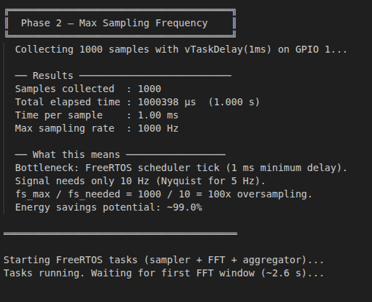

### 2. FFT And Adaptive Sampling

The clean signal contains `3 Hz` and `5 Hz` components. The `5 Hz` component has the larger amplitude, so the FFT should find `5 Hz` as the dominant frequency.

These frequency terms are separate and should not be mixed:

| Term | Value | Meaning |
| --- | ---: | --- |
| Signal frequencies | `3 Hz`, `5 Hz` | Frequencies inside the generated input signal |
| Dominant frequency | about `5.02 Hz` | Strongest component detected by the FFT |
| Runtime sampling frequency | `50 Hz -> 40 Hz` | How often the ESP32 samples the virtual signal |
| Maximum benchmark frequency | `56561 Hz` raw / `999 Hz` task-paced | Capability measurements, not the normal operating rate |

The reference signal is generated directly in [firmware/src/sensor.cpp](firmware/src/sensor.cpp):

```cpp
float generate_sample(float t_seconds) {
    float c3hz = 2.0f * sinf(TWO_PI * 3.0f * t_seconds);
    float c5hz = 4.0f * sinf(TWO_PI * 5.0f * t_seconds);
    return c3hz + c5hz;
}
```

This is the central validation point of the project. Because the expected answer is known before the run, the FFT result is not just a random number from a black box: it can be checked directly against the signal formula.

```text
dominant = 5.00 Hz
adaptive fs = 8 * dominant = 40.0 Hz
```

Nyquist says a `5 Hz` signal needs at least `10 Hz` sampling in an ideal case. This firmware uses a more conservative `8x` policy for the real pipeline. It gives cleaner FFT windows and more timing margin while FreeRTOS tasks, queues, aggregation, MQTT, LoRaWAN attempts, display updates, and anomaly modes are also running. It still reduces work compared with the fixed `50 Hz` baseline:

```text
Nyquist minimum: 5 Hz -> 10 Hz
current policy:  5 Hz -> 40 Hz
baseline:        50 Hz
```

The sampler reads the current adaptive rate each cycle, generates one virtual sample, then advances virtual time by `1 / fs`:

```cpp
xSemaphoreTake(g_fs_mutex, portMAX_DELAY);
float fs = g_fs_current;
xSemaphoreGive(g_fs_mutex);

float raw = generate_sample(t);
t += 1.0f / fs;
```

The FFT task converts the detected peak into the next sampling rate:

```cpp
double dominant = fft.majorPeak();

float new_fs = (float)dominant * TASKS_ADAPTIVE_OVERSAMPLING_FACTOR;
new_fs = round_to_step(new_fs, TASKS_ADAPTIVE_STEP_HZ);
new_fs = clamp_float(new_fs, TASKS_ADAPTIVE_MIN_FS_HZ, TASKS_ADAPTIVE_MAX_FS_HZ);

g_fs_current = new_fs;
```

The current FreeRTOS timing is millisecond-paced:

```cpp
uint32_t ms = (uint32_t)(1000.0f / fs);
if (ms == 0) ms = 1;

vTaskDelay(pdMS_TO_TICKS(ms));
```

Real log pattern:

```text
[FFT]  dominant = 5.00 Hz  policy=8.0x  ->  fs updated to 40.0 Hz
```

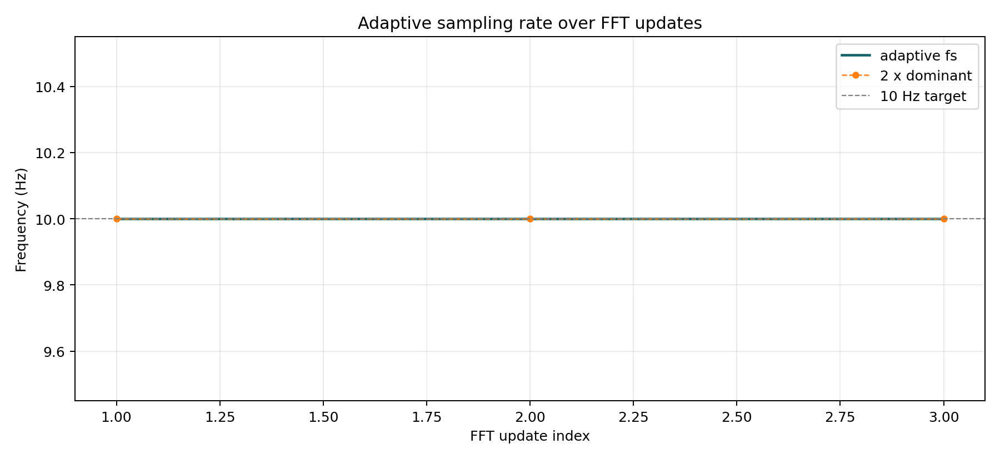

### 3. Aggregation

The aggregate is the mean over the latest `5 s` of samples. After adaptation:

```text
n = fs * window = 40 Hz * 5 s = 200 samples
```

The aggregation task wakes every `5 s`, computes the target sample count from the current `fs`, and averages the newest samples from the ring buffer:

```cpp
vTaskDelay(pdMS_TO_TICKS(5000));

uint16_t target_samples = (uint16_t)lroundf(fs * 5.0f);
float mean = ring_buffer_mean_last(target_samples);
```

The previous canonical run showed five consecutive adapted windows with `n=50` under the old `10 Hz` policy. The fresh `2026-05-13` capture confirms the current new-fixes policy with `14` parsed windows, all at `n=200` and `fs=40.0 Hz`.

```text
[AGG]  win=...  mean=...  n=200  fs=40.0 Hz
```

Evidence:

- [source/results/20260422_clean_dut_no_ina219_60s_v2/results_agg.csv](source/results/20260422_clean_dut_no_ina219_60s_v2/results_agg.csv)

This is also the main reason the project saves network traffic. The node does not need to publish every raw point; it keeps the raw samples locally, computes the window summary, and sends only the value that the edge server needs.

### 4. MQTT Over WiFi

The MQTT path publishes one aggregate value per window to `eri/iot/average`. The edge server receives the aggregate and echoes `eri/iot/ping` on `eri/iot/pong` for RTT measurement.

MQTT is the best live-demo path because it has two visible sides: the ESP32 serial log shows the send event, and the Python edge listener shows the received value. Matching those two logs proves delivery more clearly than only showing a successful `publish()` call.

The current firmware keeps the old compact average topic and also publishes a metadata-rich JSON aggregate:

```cpp
snprintf(json_buf, sizeof(json_buf),
         "{\"window\":%lu,\"mean\":%.4f,\"samples\":%u,"
         "\"fs_hz\":%.1f,\"dominant_hz\":%.2f,\"rtt_ms\":%lld}",
         window_id,
         mean,
         sample_count,
         fs_hz,
         dominant_hz,
         s_last_rtt_ms);
```

MQTT edge communication flow:

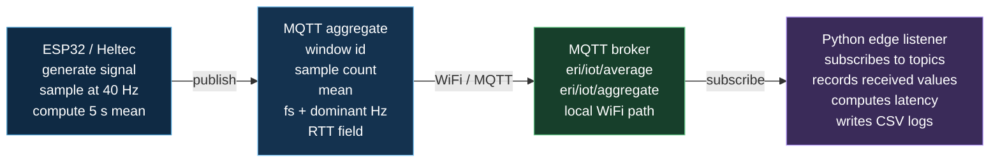

Result: the edge server receives one aggregate per `5 s` window, not the raw sample stream.

Canonical run:

| Metric | Value |
| --- | ---: |
| MQTT messages sent | `5` |
| MQTT messages received | `5` |
| Missing aggregate messages | `0` |
| Legacy average payload size | `6-7 B` |
| New JSON aggregate payload | metadata-rich; size depends on values |
| MQTT RTT mean | `630.6 ms` |
| Publish-to-edge mean | `98.4 ms` |

Sender/receiver match:

```text
send: 2026-04-22T12:05:16.901+02:00,92,0.0006,6,...
recv: 2026-04-22T12:05:16.997+02:00,eri/iot/average,0.0006
```

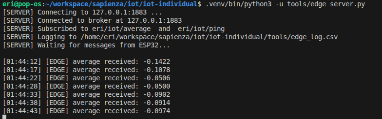

### 5. LoRaWAN / TTN

LoRaWAN sends the same aggregate mean through the Heltec SX1262 radio using RadioLib `6.6.0`. This path is validated as observed evidence, but it is less repeatable than local MQTT because TTN coverage and radio timing dominate the result.

The LoRaWAN numbers should be interpreted differently from MQTT. MQTT demonstrates nearby edge processing with low latency. LoRaWAN demonstrates long-range cloud uplink, where slower and more variable delivery is expected and acceptable for infrequent summaries.

Both communication paths receive the same aggregate result from [firmware/src/aggregator.cpp](firmware/src/aggregator.cpp):

```cpp
lorawan_send(mean);
mqtt_send(mean, window_count, n, fs, g_last_fft_dominant_hz);
```

Canonical run:

| Metric | Value |
| --- | ---: |
| Captured uplinks | `5` |
| Payload | `2 B` encoded mean |
| Mean latency | `11829.2 ms` |
| Range | `1589-24863 ms` |

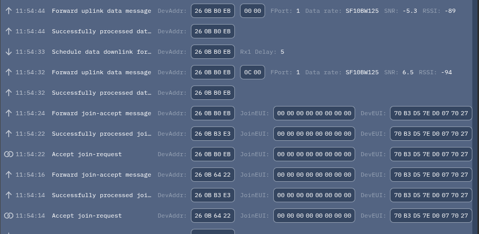

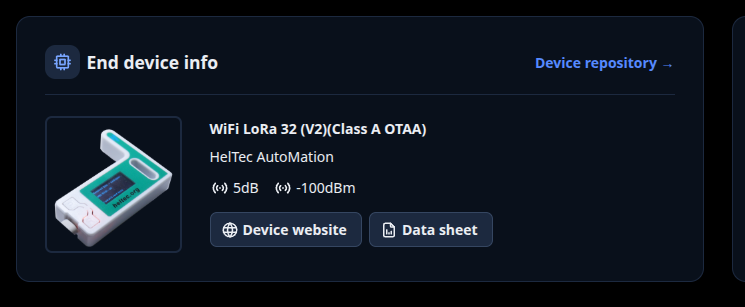

### 6. Energy Measurement

Power was measured with a second ESP32 and INA219 monitor at the DUT input. This is a real external measurement, not only a firmware estimate.

The power result is included to show the whole-board cost, not only the CPU cost of sampling. On this hardware, WiFi idle current and radio transmission bursts are large enough that reducing sampling work alone does not automatically create a large measured power drop.

Measured `60 s` monitor run:

| Metric | Value |
| --- | ---: |
| Mean bus voltage | `4.945 V` |
| Overall average current | `150.67 mA` |
| Overall average power | `734.90 mW` |
| Estimated daily charge | `3616.08 mAh/day` |
| Estimated daily energy | `17.64 Wh/day` |

State breakdown:

| State | Share | Avg current | Avg power |
| --- | ---: | ---: | ---: |
| `WIFI_IDLE` | `94.67%` | `146.40 mA` | `717.30 mW` |
| `ACTIVE` | `1.33%` | `173.25 mA` | `753.50 mW` |
| `TX` | `4.00%` | `244.23 mA` | `1145.17 mW` |

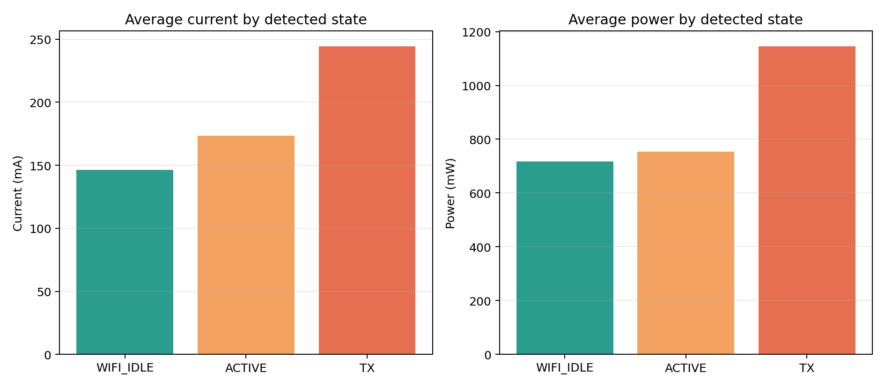

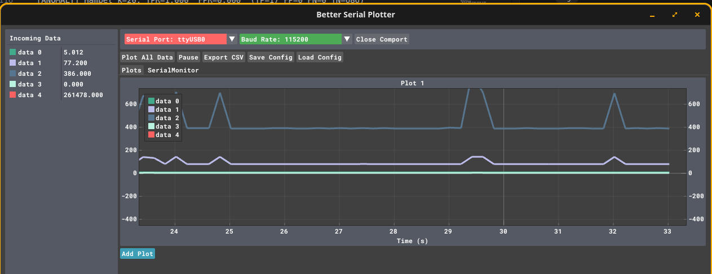

Important interpretation: this run shows that always-on WiFi and TX bursts dominate the measured power profile. Adaptive sampling reduces local sample work, but the current repository does not yet contain a paired external INA219 A/B test comparing forced oversampling against adaptive sampling.

### 7. Network Volume

The real implementation sends one aggregate payload instead of streaming all raw samples. The current firmware publishes two MQTT views of the same result: a compact legacy average on `eri/iot/average`, and a richer JSON aggregate on `eri/iot/aggregate`.

This comparison is intentionally simple: it asks how many bytes cross the network for one `5 s` result. The internal sample count affects CPU and memory work, but the transmitted MQTT payload stays small because the edge server receives only the aggregate.

Baseline used for the new-fixes comparison:

```text
50 Hz * 5 s * 4 B = 1000 B
```

Observed legacy MQTT average payload:

```text
6-7 B per 5 s window
```

| Case | Bytes per 5 s window |
| --- | ---: |
| Raw float stream at fixed `50 Hz` | `1000 B` |
| Legacy average payload | `6-7 B` |
| JSON aggregate payload | larger, but includes useful metadata |
| Reduction factor | depends on whether the compact or JSON topic is counted |

This is the cleanest network claim: local aggregation makes network volume depend on the summary payload, not on the internal sample count.

### 8. Bonus Signal And Anomaly Work

The firmware supports multiple signal modes through PlatformIO build flags:

| Env | Behavior |
| --- | --- |
| `clean` | clean sinusoidal baseline |
| `noise` | clean signal plus Gaussian noise |
| `spikes` | noisy signal plus injected spikes |
| `spikes_p1`, `spikes_p5`, `spikes_p10` | spike probability variants |
| `clean_b`, `clean_c` | alternate clean multi-tone formulas |

Three clean signal variants show an important limitation of the current adaptive rule: it follows the dominant FFT peak, not always the highest-frequency tone present.

| Signal | Formula | Expected highest | Measured dominant | Adaptive fs |
| --- | --- | ---: | ---: | ---: |
| A | `2*sin(2*pi*3*t)+4*sin(2*pi*5*t)` | `5 Hz` | `5.00 Hz` | `10.00 Hz` |
| B | `4*sin(2*pi*3*t)+2*sin(2*pi*9*t)` | `9 Hz` | `3.01 Hz` | old run: `10.00 Hz`; current policy would target about `25 Hz` |
| C | `2*sin(2*pi*2*t)+3*sin(2*pi*5*t)+1.5*sin(2*pi*7*t)` | `7 Hz` | `5.03 Hz` | old run: `10.10 Hz`; current policy would target about `40 Hz` |

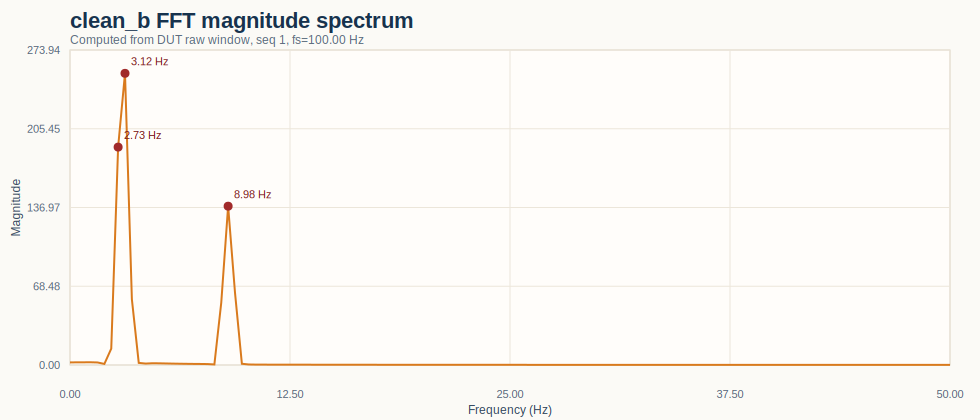

This is useful for the bonus discussion because it shows both the strength and the limitation of the simple dominant-peak controller.

## Evidence Gallery

| Evidence | What it shows |
| --- | --- |
|  | practical sampling benchmark |
| 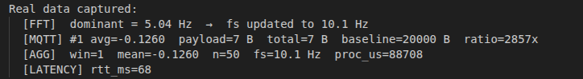 | FFT and adaptive-rate convergence |
|  | MQTT edge listener receiving aggregates |
| 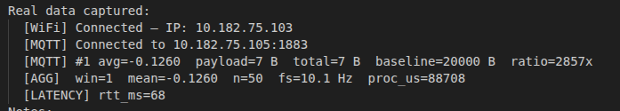 | MQTT RTT output |
| 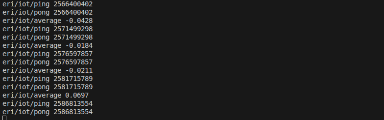 | MQTT topic-level visibility |
|  | LoRaWAN uplink activity |
| 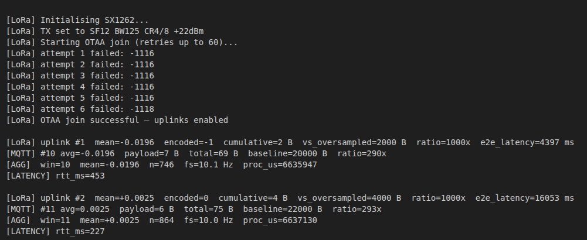 | DUT-side LoRa logs |
|  | INA219 current/power live view |
| 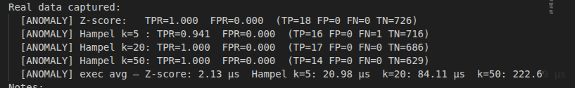 | spike/anomaly logs |

## Setup And Run

### 1. Configure credentials

Credentials are intentionally not committed. Create the local config file:

```bash
cp firmware/src/config.h.example firmware/src/config.h
```

Then fill WiFi, MQTT broker, and optional TTN values.

### 2. Flash firmware

The system `pio` on this machine is known to be broken. Use the user PlatformIO install:

```bash
cd firmware
~/.platformio/penv/bin/pio run -e heltec_wifi_lora_32_V3 -t upload --upload-port /dev/ttyUSB0
```

Useful environments:

```bash
~/.platformio/penv/bin/pio run -e clean -t upload --upload-port /dev/ttyUSB0
~/.platformio/penv/bin/pio run -e noise -t upload --upload-port /dev/ttyUSB0
~/.platformio/penv/bin/pio run -e spikes -t upload --upload-port /dev/ttyUSB0
~/.platformio/penv/bin/pio run -e spikes_p5 -t upload --upload-port /dev/ttyUSB0
```

### 3. Start MQTT edge path

Start a local broker in one terminal:

```bash
mosquitto -v
```

Start the edge listener in another terminal:

```bash
python3 tools/edge_server.py
```

Optionally watch all topics:

```bash
mosquitto_sub -t 'eri/iot/#' -v
```

### 4. Monitor serial output

Non-interactive `pio device monitor` can fail on this setup, so use:

```bash
stty -F /dev/ttyUSB0 115200 raw cs8 -cstopb -parenb
cat /dev/ttyUSB0
```

Expected log prefixes:

```text
[FFT]       dominant frequency and adaptive fs
[AGG]       5 s window mean and sample count
[MQTT]      aggregate publish and byte accounting
[LATENCY]   MQTT RTT
[LoRa]      LoRaWAN join/uplink status
[ENERGY]    firmware-side proxy energy model
[ANOMALY]   spike/filter metrics
```

## Presentation Walkthrough

Use this order for a short project walkthrough:

1. Show the signal formula and explain that it is generated in [firmware/src/sensor.cpp](firmware/src/sensor.cpp).
2. Show the FFT plot: the dominant component is `5 Hz`.
3. Show the adaptive-rate plot: the current firmware should move to `40 Hz`.
4. Show aggregation: `40 Hz * 5 s = 200 samples`, matching the new expected `[AGG]` logs after a fresh capture.
5. Show MQTT: sender and edge receiver match all `5` messages.
6. Show network volume: the compact average is tiny, while the JSON aggregate is more realistic because it carries context.
7. Show latency: local MQTT is fast; LoRaWAN is much slower and variable.
8. Show power: measured power is dominated by WiFi idle and TX, so energy claims are cautious.
9. Use bonus plots to explain that the controller tracks the dominant peak, not necessarily the highest tone.

## Known Limits

These are deliberate, honest limits to mention if asked:

- No paired external INA219 A/B run is stored yet for forced oversampling versus adaptive sampling.
- Secure MQTT/TLS is not currently validated in this repo; MQTT evidence is local broker evidence.
- LoRaWAN is implemented and observed, but repeatability depends on gateway coverage and TTN behavior.
- The adaptive rule follows the dominant FFT peak. If a weaker high-frequency component exists, the current controller may undersample it.
- The current task pinning should be reviewed against the project rulebook if core affinity is graded strictly.

## Final Takeaway

The defendable result is that the ESP32 generates a known signal, detects the expected `5 Hz` dominant frequency, adapts with a conservative `8x` policy toward `40 Hz`, computes `5 s` aggregates, and delivers those aggregates through MQTT with both compact and metadata-rich payload options. LoRaWAN, power measurement, and anomaly modes are present as supporting work, with their limitations labeled clearly.
