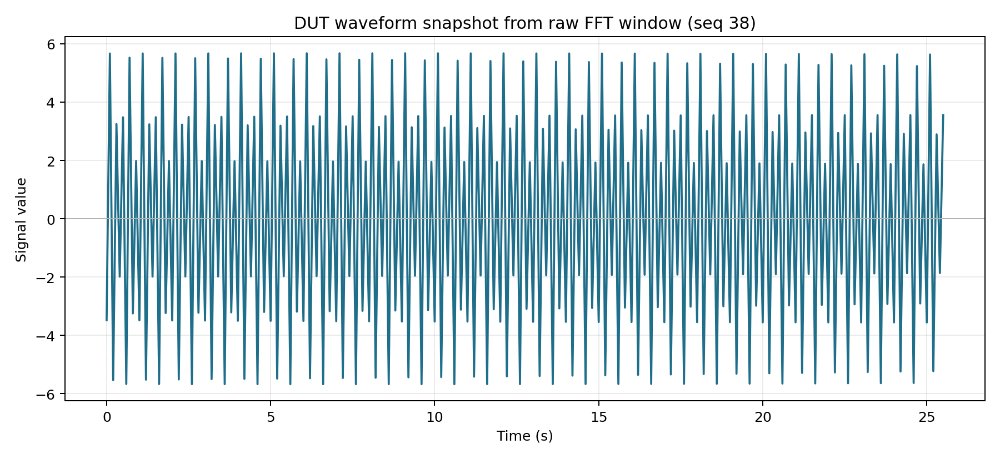
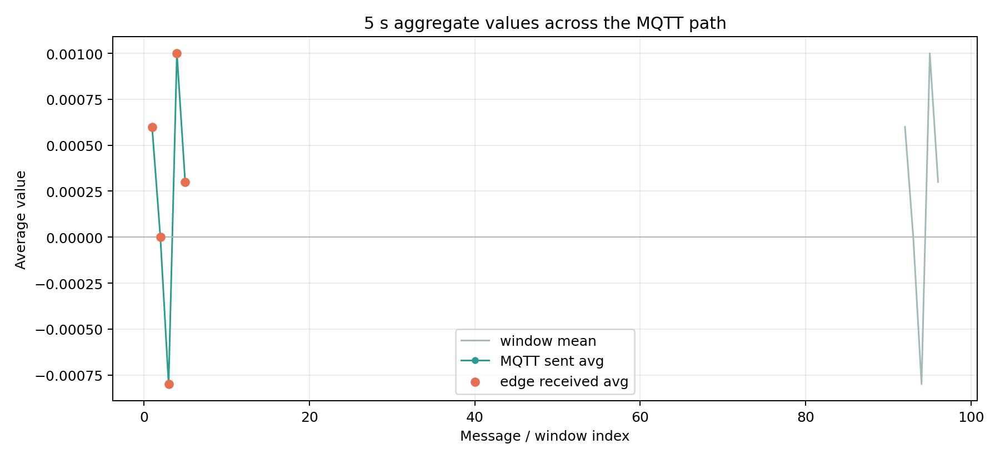
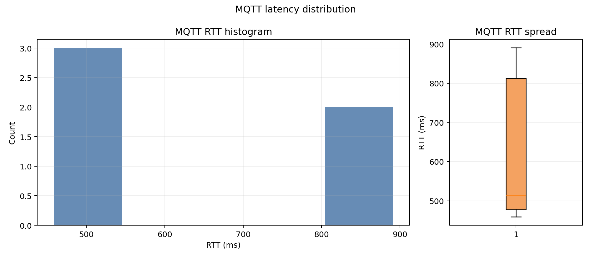
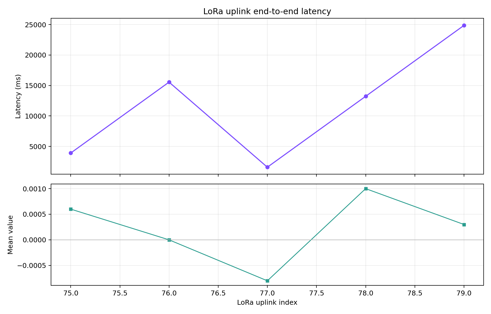

# Results

This folder contains curated submission-style exports of validated DUT runs.

Start with:

- [`20260422_clean_dut_no_ina219_60s_v2/SUMMARY.md`](/home/eri/workspace/sapienza/iot/iot-individual/source/results/20260422_clean_dut_no_ina219_60s_v2/SUMMARY.md)
- [`20260422_clean_dut_no_ina219_60s_v2/PLOT_DATA_RECORDS.md`](/home/eri/workspace/sapienza/iot/iot-individual/source/results/20260422_clean_dut_no_ina219_60s_v2/PLOT_DATA_RECORDS.md)

The raw upstream capture session is indexed separately in:

- [`tools/plot_sessions/README.md`](/home/eri/workspace/sapienza/iot/iot-individual/tools/plot_sessions/README.md)

## Available Bundle

### `20260422_clean_dut_no_ina219_60s_v2`

Current canonical export used for the report-style figures and final evidence bundle.

Quick summary:

- clean-mode DUT run
- `60 s` capture
- `5` MQTT aggregate windows matched at the edge listener
- `5` LoRa uplinks captured
- `3` FFT updates at `5.00 Hz -> 10.0 Hz`
- no panic or reboot signatures in the exported serial log

Bundle layout:

- `SUMMARY.md`: one-page human-readable summary
- `PLOT_DATA_RECORDS.md`: figure-by-figure data provenance
- top-level `results_*.csv`: quick-access result tables
- top-level `0X_*.png`: quick-access final report figures
- `data/`: full parsed CSV outputs
- `plots/`: generated figure copies
- `logs/`: raw serial log from the DUT
- `pics/`: supporting screenshots copied from the project evidence set
- `metadata.json`: capture settings copied from the raw session

Exported from:

`tools/plot_sessions/20260422_120509_clean_dut_no_ina219_60s_v2/`

#### Generated Figures

**Figure 1**

Short description: raw DUT waveform snapshot from one captured FFT window after adaptation stabilized at `10 Hz`.

References:
- Figure file: [01_waveform_snapshot.png](/home/eri/workspace/sapienza/iot/iot-individual/source/results/20260422_clean_dut_no_ina219_60s_v2/01_waveform_snapshot.png)
- Sample data: [plot_samples.csv](/home/eri/workspace/sapienza/iot/iot-individual/source/results/20260422_clean_dut_no_ina219_60s_v2/data/plot_samples.csv:1)
- Serial markers: [serial.log](/home/eri/workspace/sapienza/iot/iot-individual/source/results/20260422_clean_dut_no_ina219_60s_v2/logs/serial.log:10) and [serial.log](/home/eri/workspace/sapienza/iot/iot-individual/source/results/20260422_clean_dut_no_ina219_60s_v2/logs/serial.log:11)

**Figure 2**

Short description: FFT magnitude spectrum computed from the same captured window, showing the dominant component around `5 Hz`.

References:
- Figure file: [02_fft_spectrum.png](/home/eri/workspace/sapienza/iot/iot-individual/source/results/20260422_clean_dut_no_ina219_60s_v2/02_fft_spectrum.png)
- Sample data: [plot_samples.csv](/home/eri/workspace/sapienza/iot/iot-individual/source/results/20260422_clean_dut_no_ina219_60s_v2/data/plot_samples.csv:1)
- Serial markers: [serial.log](/home/eri/workspace/sapienza/iot/iot-individual/source/results/20260422_clean_dut_no_ina219_60s_v2/logs/serial.log:10) and [serial.log](/home/eri/workspace/sapienza/iot/iot-individual/source/results/20260422_clean_dut_no_ina219_60s_v2/logs/serial.log:11)

**Figure 3**

Short description: adaptive sampling history across the captured run, confirming that FFT repeatedly drove the system to `10.0 Hz`.

References:
- Figure file: [03_adaptive_fs.png](/home/eri/workspace/sapienza/iot/iot-individual/source/results/20260422_clean_dut_no_ina219_60s_v2/03_adaptive_fs.png)
- FFT data: [results_fft.csv](/home/eri/workspace/sapienza/iot/iot-individual/source/results/20260422_clean_dut_no_ina219_60s_v2/results_fft.csv:1)
- Serial markers: [serial.log](/home/eri/workspace/sapienza/iot/iot-individual/source/results/20260422_clean_dut_no_ina219_60s_v2/logs/serial.log:9), [serial.log](/home/eri/workspace/sapienza/iot/iot-individual/source/results/20260422_clean_dut_no_ina219_60s_v2/logs/serial.log:39), and [serial.log](/home/eri/workspace/sapienza/iot/iot-individual/source/results/20260422_clean_dut_no_ina219_60s_v2/logs/serial.log:73)

**Figure 4**

Short description: comparison of the 5-second aggregate values produced on the DUT and received on the MQTT edge path.

References:
- Figure file: [04_aggregate_mqtt_path.png](/home/eri/workspace/sapienza/iot/iot-individual/source/results/20260422_clean_dut_no_ina219_60s_v2/04_aggregate_mqtt_path.png)
- Aggregate data: [results_agg.csv](/home/eri/workspace/sapienza/iot/iot-individual/source/results/20260422_clean_dut_no_ina219_60s_v2/results_agg.csv:1)
- MQTT send data: [mqtt_send.csv](/home/eri/workspace/sapienza/iot/iot-individual/source/results/20260422_clean_dut_no_ina219_60s_v2/data/mqtt_send.csv:1)
- MQTT receive data: [mqtt_rx.csv](/home/eri/workspace/sapienza/iot/iot-individual/source/results/20260422_clean_dut_no_ina219_60s_v2/data/mqtt_rx.csv:1)
- Serial markers: [serial.log](/home/eri/workspace/sapienza/iot/iot-individual/source/results/20260422_clean_dut_no_ina219_60s_v2/logs/serial.log:14), [serial.log](/home/eri/workspace/sapienza/iot/iot-individual/source/results/20260422_clean_dut_no_ina219_60s_v2/logs/serial.log:15), [serial.log](/home/eri/workspace/sapienza/iot/iot-individual/source/results/20260422_clean_dut_no_ina219_60s_v2/logs/serial.log:43), [serial.log](/home/eri/workspace/sapienza/iot/iot-individual/source/results/20260422_clean_dut_no_ina219_60s_v2/logs/serial.log:44), [serial.log](/home/eri/workspace/sapienza/iot/iot-individual/source/results/20260422_clean_dut_no_ina219_60s_v2/logs/serial.log:57), [serial.log](/home/eri/workspace/sapienza/iot/iot-individual/source/results/20260422_clean_dut_no_ina219_60s_v2/logs/serial.log:58), [serial.log](/home/eri/workspace/sapienza/iot/iot-individual/source/results/20260422_clean_dut_no_ina219_60s_v2/logs/serial.log:70), and [serial.log](/home/eri/workspace/sapienza/iot/iot-individual/source/results/20260422_clean_dut_no_ina219_60s_v2/logs/serial.log:71)

**Figure 5**

Short description: MQTT round-trip latency distribution measured through the ping/pong path between the DUT and the edge server.

References:
- Figure file: [05_mqtt_latency_distribution.png](/home/eri/workspace/sapienza/iot/iot-individual/source/results/20260422_clean_dut_no_ina219_60s_v2/05_mqtt_latency_distribution.png)
- Latency data: [results_latency.csv](/home/eri/workspace/sapienza/iot/iot-individual/source/results/20260422_clean_dut_no_ina219_60s_v2/results_latency.csv:1)
- Serial markers: [serial.log](/home/eri/workspace/sapienza/iot/iot-individual/source/results/20260422_clean_dut_no_ina219_60s_v2/logs/serial.log:16), [serial.log](/home/eri/workspace/sapienza/iot/iot-individual/source/results/20260422_clean_dut_no_ina219_60s_v2/logs/serial.log:29), [serial.log](/home/eri/workspace/sapienza/iot/iot-individual/source/results/20260422_clean_dut_no_ina219_60s_v2/logs/serial.log:45), [serial.log](/home/eri/workspace/sapienza/iot/iot-individual/source/results/20260422_clean_dut_no_ina219_60s_v2/logs/serial.log:59), and [serial.log](/home/eri/workspace/sapienza/iot/iot-individual/source/results/20260422_clean_dut_no_ina219_60s_v2/logs/serial.log:72)

**Figure 6**

Short description: LoRaWAN uplink latency across the captured windows, showing the slower and more variable long-range path compared with MQTT.

References:
- Figure file: [06_lora_latency.png](/home/eri/workspace/sapienza/iot/iot-individual/source/results/20260422_clean_dut_no_ina219_60s_v2/06_lora_latency.png)
- LoRa data: [results_lora.csv](/home/eri/workspace/sapienza/iot/iot-individual/source/results/20260422_clean_dut_no_ina219_60s_v2/results_lora.csv:1)
- Serial markers: [serial.log](/home/eri/workspace/sapienza/iot/iot-individual/source/results/20260422_clean_dut_no_ina219_60s_v2/logs/serial.log:13), [serial.log](/home/eri/workspace/sapienza/iot/iot-individual/source/results/20260422_clean_dut_no_ina219_60s_v2/logs/serial.log:26), [serial.log](/home/eri/workspace/sapienza/iot/iot-individual/source/results/20260422_clean_dut_no_ina219_60s_v2/logs/serial.log:42), [serial.log](/home/eri/workspace/sapienza/iot/iot-individual/source/results/20260422_clean_dut_no_ina219_60s_v2/logs/serial.log:56), and [serial.log](/home/eri/workspace/sapienza/iot/iot-individual/source/results/20260422_clean_dut_no_ina219_60s_v2/logs/serial.log:69)
